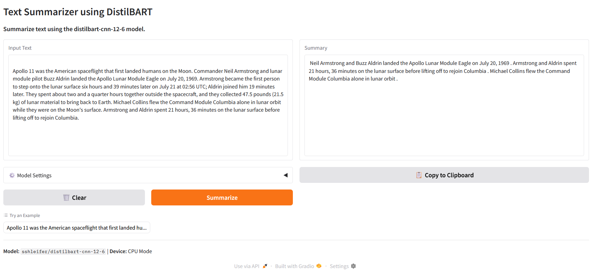

# 📝 Text Summarizer with DistilBART


A fast, **local text summarization application** that generates concise summaries from long articles or documents using a pretrained abstractive model.

Built with Python, **DistilBART**, and **Gradio** for a clean, split-view browser interface.

---

## 🖼️ App Demo Screenshot



---

## ✨ Features

* **100% Offline:** Runs entirely on your machine after the initial model download.
* **No API Keys:** No Hugging Face token or external APIs required.
* **Split-View Interface:** Compare original text and generated summary side-by-side.
* **Customizable Output:** Control minimum and maximum summary length via sliders.
* **Deterministic Results:** Uses optimized decoding (`do_sample=False`) for consistent summaries.

---

## 🛠️ Tech Stack

* **UI:** Gradio
* **Model:** `sshleifer/distilbart-cnn-12-6`
* **Task:** Abstractive Text Summarization
* **Framework:** PyTorch + Transformers

---

## 📦 Installation

### 1. Clone the Repository
```bash
git clone https://github.com/arman1o1/text-summarizer-distilbart.git
cd text-summarizer-distilbart
````

### 2. Install Dependencies

It is recommended to use a virtual environment.

```bash
pip install -r requirements.txt
```

---

## ▶️ Usage

Run the application locally:

```bash
python app.py
```

On first run, the model weights will be downloaded automatically (approximately 1–2 minutes on CPU).

Once ready, the terminal will display a local URL:

```text
Running on local URL: http://127.0.0.1:7860
```

Open the link in your browser to start summarizing text.

---

## ⚙️ Technical Details

* **Model:** [sshleifer/distilbart-cnn-12-6](https://huggingface.co/sshleifer/distilbart-cnn-12-6)
* **Inference:** Uses the Hugging Face `pipeline` API
* **Decoding:** Deterministic beam search (`do_sample=False`)
* **Caching:** Model weights are cached locally after first download

---

## 📄 License

The application code in this repository is licensed under the **MIT License**.

The model used (`distilbart-cnn-12-6`) is licensed under **Apache 2.0**.
```
```
