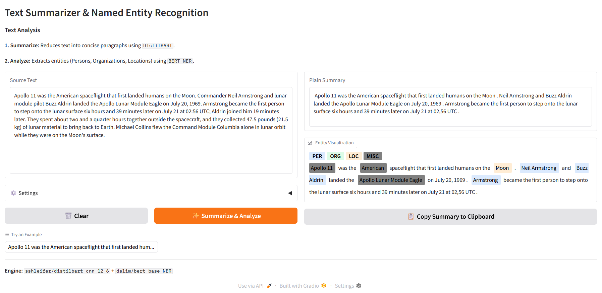

# Text Summarizer & Named Entity Recognition


A comprehensive natural language processing tool that condenses long articles into concise summaries and automatically identifies key entities (People, Organizations, Locations) within the result.

Built with **DistilBART** for summarization, **BERT** for entity recognition, and **Gradio** for a modern, interactive web interface.

## App Interface
<!-- You can add a screenshot here named demo.png -->


## Features

*   **Dual-Pipeline Analysis:** Automatically runs two distinct AI models in sequence:
    1.  **Summarization:** Compresses the text while retaining core meaning.
    2.  **NER Analysis:** Scans the *summary* to highlight important entities.
*   **Visual Entity Highlighting:** Uses color-coded tags to visualize:
    *   <span style="color:blue">PER</span> (Persons)
    *   <span style="color:green">ORG</span> (Organizations)
    *   <span style="color:orange">LOC</span> (Locations)
*   **Offline Capable:** Runs locally on your machine. No API keys or internet connection required after initial setup.
*   **Interactive Controls:** Adjust minimum and maximum summary lengths via sliders.
*   **One-Click Copy:** Includes a JavaScript-powered button to instantly copy the summary to your clipboard.

## Installation

### 1. Clone the Repository
```bash
git clone https://github.com/arman1o1/text-summarizer-distilbart.git
cd text-summarizer-distilbart
cd text-summarizer-ner
```

### 2. Install Dependencies
It is recommended to use a virtual environment (venv or conda).
```bash
pip install -r requirements.txt
```

*Note: If `requirements.txt` does not work, install the core packages manually:*
```bash
pip install gradio transformers torch tf-keras
```

## Usage

Run the application using Python:

```bash
python app.py
```

### First Run Note
On the very first launch, the application will download the model weights (approx 1.5GB total) from Hugging Face. This may take a few minutes depending on your internet speed.

Once loaded, the terminal will display:
```text
Running on local URL:  http://127.0.0.1:7860
```
Open this link in your browser to start analyzing text.

## Technical Details

The application uses a pipeline approach to process text:

1.  **Summarization Model:** [`sshleifer/distilbart-cnn-12-6`](https://huggingface.co/sshleifer/distilbart-cnn-12-6)
    *   A distilled version of BART, trained on the CNN/DailyMail dataset. It offers excellent performance with lower resource usage than the full BART model.
2.  **NER Model:** [`dslim/bert-base-NER`](https://huggingface.co/dslim/bert-base-NER)
    *   A fine-tuned BERT model capable of recognizing four types of entities: Location (LOC), Organizations (ORG), Person (PER), and Miscellaneous (MISC).
3.  **Token Aggregation:**
    *   The app uses `aggregation_strategy="simple"`. This ensures that sub-word tokens (e.g., "New", "York") are merged into single understandable entities ("New York") for the display.

## License

This project is open-source and available under the [MIT License](LICENSE).
The underlying models are subject to their respective licenses on the Hugging Face Hub.
